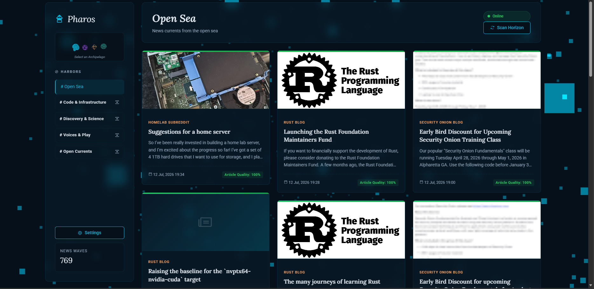
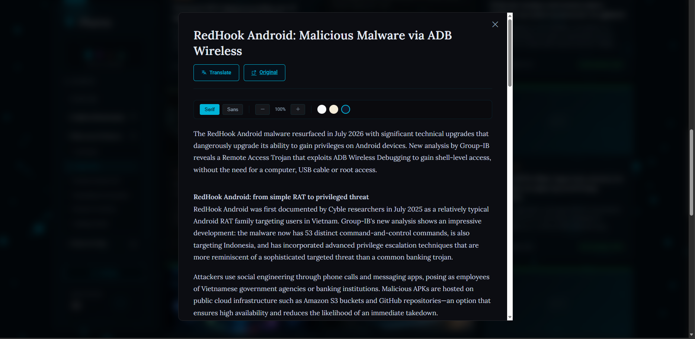
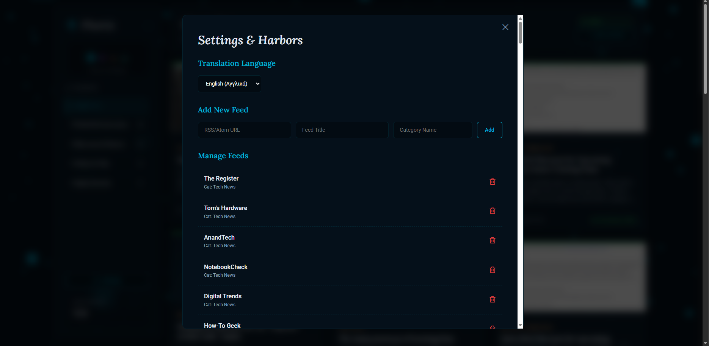

# Pharos (FeedFlow V2) — Modern News Feed Aggregator

  

**Pharos** is a modern, high-performance asynchronous news feed aggregator built with **FastAPI**, **SQLAlchemy** (Async), and a stunning **Glassmorphic** frontend. It supports RSS/Atom feeds, smart web scraping, automatic Open Graph image extraction, and built-in article translation.

> 🧠 **Standout feature:** Pharos ships with a built-in **5-layer anti-slop quality engine** that automatically scores every incoming article and filters out clickbait, AI-generated "slop" writing, spam/promotional content, and near-duplicates — before they ever reach your feed. See [Quality Engine](#-anti-slop--quality-scoring-engine) below.

---

## 📸 Screenshots

| Home Page / Feed | Reader Mode |
|:---:|:---:|
|  |  |
| **Translation Feature** | **Settings Panel** |
|  |  |

---

## ✨ Features

- **🚀 High Performance (Async)**: Utilizes `aiohttp` and `asyncio.gather` with semaphores to concurrently process dozens of feeds without lag.
- **🛡️ Cloudflare Bypass**: Smart system that detects if a site blocks scraping (403 Error) and automatically falls back to a Google Translate proxy to fetch the content.
- **📂 Automatic Categorization**: Ability to create categories on-the-fly. New feeds are automatically sorted and displayed in the sidebar navigation.
- **⚡ SQLite in WAL Mode**: Database optimized to prevent "database is locked" errors and support high concurrency.
- **🔄 Cursor-Based Pagination**: Infinite scrolling without duplicate articles and minimal database load, even with thousands of records.
- **🎨 Glassmorphic UI**:
  - Animated WebGL particle background (Three.js).
  - Lighthouse loading animation.
  - Reader Mode for a distraction-free reading experience (Readability.js).
- **🌍 Translation & Custom Scrapers**: Built-in translation and specialized scrapers for websites that lack RSS (e.g., AEK365).
- **📦 Docker Ready**: Ready-to-use Dockerfile for easy deployment anywhere.
- **🧠 Anti-Slop Quality Engine**: A 5-layer scoring system that detects clickbait, AI-generated "slop" text, spam/promotional content, and near-duplicate articles, automatically filtering out anything that doesn't meet the quality threshold.

---

## 🧠 Anti-Slop & Quality Scoring Engine

Pharos is not just an aggregator — every article passes through a **multi-layer quality scoring system** (`filters.py`) before appearing in the feed. Each layer applies a penalty to the article's quality score (ranging from 0.0 to 1.0). Articles scoring below the threshold (`QUALITY_THRESHOLD = 0.3`) are automatically marked as `is_filtered` and hidden from the main feed.

| Layer | What it detects | Example signals |
|---|---|---|
| **1. Clickbait Detection** | Bait titles | "you won't believe", "shocking", excessive CAPS/! ? |
| **2. AI Slop Detection** | Typical LLM-generated phrases | "in today's rapidly evolving", "let's dive in", "unlock the power" |
| **3. Content Quality** | Weak content structure | exceptionally short title, missing or incomplete summary |
| **4. Spam / Promo Detection** | Advertising or sponsored content | "sponsored", "promo code", emoji spam |
| **5. Fuzzy Duplicate Detection** | Near-duplicate / repost articles | `rapidfuzz` token-sort similarity ≥ 85–95% against recent titles |

The system runs live on every new article during the fetch process, and it can also be run retrospectively across the entire database using:
```bash
python backfill_quality.py
```
The script outputs live statistics (pass rate, filtered count) and updates the `quality_score` / `filter_flags` / `is_filtered` fields for every article.

There is also a live `GET /api/stats/quality` endpoint that returns the total number of filtered articles and the average quality score of all articles — ensuring complete transparency regarding the system's filtering rate.

---

## 🛠️ Tech Stack

- **Backend**: Python 3.11+, FastAPI, SQLAlchemy (Async), Pydantic.
- **Database**: SQLite (Asyncio).
- **Frontend**: Vanilla JS (ES6+), Three.js (Background), CSS Grid/Flexbox (Glassmorphism).
- **Libraries**: `feedparser`, `beautifulsoup4`, `readability-lxml`, `deep-translator`.

---

## 🚀 Quick Start

### 🐳 Using Docker (Recommended)

The application is configured to **automatically seed** the default feeds and initiate the **first article synchronization** upon startup.

1. **Pull and run the image**:
   ```bash
   docker run -d -p 8000:8000 --name pharos christosk89/feedflow:latest
   ```
2. **Access**: Open your browser and navigate to `http://localhost:8000`.

*Note: To prevent data loss when the container is removed, use volumes:*
```bash
docker run -d -p 8000:8000 -v pharos_data:/app christosk89/feedflow:latest
```

### 💻 Local Setup

1. **Clone & Virtual Env**:
   ```bash
   git clone <your-repo-url>
   cd feedflow-v2
   python -m venv venv
   source venv/bin/activate  # On Windows: .\venv\Scripts\Activate.ps1
   ```

2. **Install Dependencies**:
   ```bash
   pip install -r requirements.txt
   ```

3. **Configure `.env`**:
   Create a `.env` file:
   ```env
   ADMIN_USERNAME=admin
   ADMIN_PASSWORD=your_password
   ```

4. **Run**:
   ```bash
   uvicorn main:app --reload
   ```
   *The database will be automatically created and populated with default feeds on the first run.*

---

## 📂 Project Structure

- `main.py`: API endpoints and startup logic.
- `fetcher.py`: The "heart" of the system. Manages parsing, scraping, and Cloudflare bypass.
- `seeder.py`: Contains hardcoded default feeds (Tech News, Greek Tech, etc.).
- `models.py`: Database schemas.
- `static/`: All frontend code (HTML/CSS/JS).
- `backfill_images.py`: Utility to fetch Open Graph images for older articles.
- `filters.py`: The anti-slop quality engine — clickbait, AI-slop, spam/promo, and fuzzy-duplicate detection.
- `backfill_quality.py`: Utility for retrospective quality scoring on already saved articles.

---

## 🧪 Testing

Run the unit tests to verify the correct operation of the scraper and URL cleaning:
```bash
python -m unittest test_fetcher.py -v
```

---

## 📝 License

MIT License — see [LICENSE](LICENSE).
